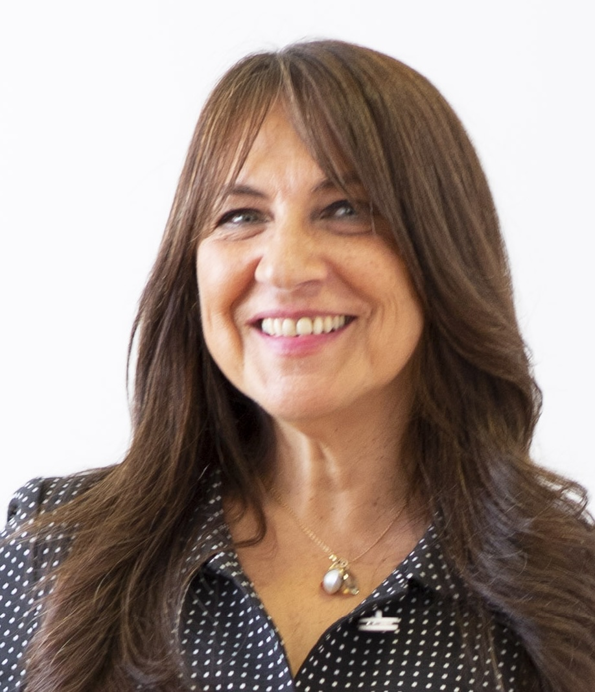
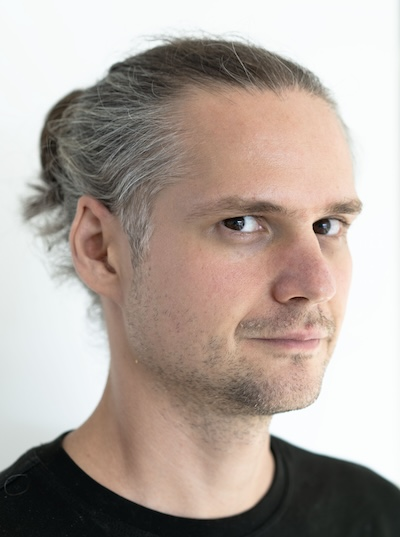

  <h3 class="display-4">Workshop report available!</h3>
  
The results of the workshop were summarized in an workshop report for the SIGIR Forum. A <a href="https://arxiv.org/abs/2409.18024">preprint of the Sim4IA 2023 report</a> is available at arXiv.org.
  
  

    <a class="btn btn-primary btn-lg" href="https://arxiv.org/abs/2409.18024" role="button">Access arXiv preprint</a>
  

## tl;dr

Interactive and engaging Workshop on Simulations for Information Access at [SIGIR 2024](https://sigir-2024.github.io/) in Washington, D.C. (onsite, limited hybrid participation) - **1st submission round ended** - Some slot for lightning talks / extended abstracts still available - Submit to [EasyChair](https://easychair.org/conferences/?conf=sim4ia-sigir2024) until July 4 latest, or whenever all available slots are filled.

## Updates

- If you would like to attend the Sim4IA workshop remotely and you are registered for the SIGIR ‘24 Conference or the SIGIR ‘24 Workshop Day please send an email to <ckreutz@acm.org> to receive the Zoom credentials.
- Join the Sim4IA workshop at the [ACM SIGIR Slack](http://acmsigir.slack.com) on #sigir2024-sim4ai-workshop! Contact the organizers if you need an invite.
- Our second keynote by [Martin Mladenov](https://scholar.google.de/citations?user=Gc65LRwAAAAJ&hl=en) was confirmed, and we updated information on the panel and the overall schedule.
- Information on 1st keynote and a list of 1st round of accepted lightning talks are included below.
- **1st submission round ended** - Thank you for your timely commitment - We will review everything submitted on time and notify all authors ASAP, as originally announced. For those of you who were struggling with the deadline or would like to present a lightning talk with very recent results, etc. - The [submission system](https://easychair.org/conferences/?conf=sim4ia-sigir2024) is still open, and as long as there are free slots remaining, you can continue to submit an extended abstract. This second round of submissions will end 4 July latest - or whenever all available slots are filled.
- [Registration information](#registration) included.
- We are happy to announce that ~~[Leif Azzopardi](https://www.strath.ac.uk/staff/azzopardileifdr/) (University of Strathclyde) and~~ [Gabriella Pasi](https://ikr3.disco.unimib.it/people/gabriella-pasi/) (University of Milano-Bicocca) will give our two keynotes. 
<!-- He is one of the co-organizers of the 2010 SIGIR Workshop on the simulation of interaction and one of the authors of the original SIMIIR framework.-->

## About

Simulations in various forms have been used to evaluate information access systems, like search engines, recommender systems, or conversational agents. In the form of the Cranfield paradigm, a simulation setup is well-known in the IR community, but user simulations have recently gained interest. While user simulations help to reduce the complexity of evaluation experiments and help with reproducibility, they can also contribute to a better understanding of users. Building on recent developments in methods and toolkits, the **SIGIR 2024 Workshop on Simulations for Information Access** (Sim4IA @ SIGIR 2024) aims to bring together researchers and practitioners to form an interactive and engaging forum for discussions on the future perspectives of the field. An additional aim is to plan an upcoming TREC/CLEF campaign.

The Sim4IA workshop will be co-located with the [47th International ACM SIGIR Conference on Research and Development in Information Retrieval](https://sigir-2024.github.io/) on **July 18, 2024** in Washington D.C., USA. 

### Objective
This workshop aims to bring together experts and enthusiasts from academia and industry to delve into the challenges, methodologies, and applications of simulating user interactions with information access systems. Simulating user behavior is crucial for evaluating the effectiveness and efficiency of retrieval algorithms, user interfaces, and personalized recommendation systems. 

We anticipate a **highly interactive** and **engaging**, **full-day** workshop to foster collaborations and bring the community together. 
We are keen to hear different views and opinions on the current and future directions for simulations in information access systems. 
Therefore, we are planning to offer two keynotes, a panel discussion with selected participants, lightning talks (~5 minutes), and guided breakout sessions.

<!--
- **Keynotes.** We intend to have two keynotes representing viewpoints from industry and academia.
- **Lightning talks.** We allocate short slots (3-5 minute talks) for accepted opinion pieces and encore talks from a selection of different viewpoints for onsite presentation. 
- **Panel discussion.** We will moderate a panel with invited panelists from a diverse set of backgrounds championing different subfields and views.
- **Breakout group discussions.** The core of this workshop is to initiate a discussion among the participants. We will guide the breakout discussions.
-->

### Hybrid setting - Zoom and Slack
To enable interaction with a broader set of participants, we offer limited hybrid participation in addition to onsite attendance via Zoom and Slack. Zoom links will be provided through the ACM to all registered participants. Join the Sim4IA workshop at the [ACM SIGIR Slack](http://acmsigir.slack.com) on #sigir2024-sim4ai-workshop! Contact the organizers if you need an invite.

### Keynotes

#### Gabriella Pasi - Modeling users’ preferences and context: which information and how?
 Gabriella Pasi is Professor at the Department of Informatics, Systems, and Communication of the University of Milano-Bicocca, where she leads the [Information and Knowledge Representation, Retrieval, and Reasoning (IKR3) research Lab](https://ikr3.disco.unimib.it/). Her main research interests include user modelling and personalization in systems for information access, and personal and contextual LLMs. Her research is supported by numerous grants; among her recent recognitions is the 2023 Outstanding Research Contributions Award of the Web Intelligence Consortium.

#### Martin Mladenov - User simulation as an engineering tool: the road ahead (with RecSim NG)
 Martin Mladenov is a senior research scientist at Google Research. His research is focused on the modeling, measurement, and steering of recommender ecosystems from a methodological, behavioral, and social choice perspective. He is one of the leads of the RecSim and RecSim NG projects.  

### Panel

- [Johanne Trippas](https://www.johannetrippas.com/), RMIT University
- [ChengXiang Zhai](https://czhai.cs.illinois.edu/), University of Illinois at Urbana-Champaign
- [Gabriella Pasi](https://ikr3.disco.unimib.it/), University of Milano-Bicocca
- [Martin Mladenov](https://scholar.google.de/citations?user=Gc65LRwAAAAJ&hl=en), Google

The panel will be moderated by Norbert Fuhr.

### Accepted presentations

ID | Authors | Title
---|---|---
1 | Saber Zerhoudi and Michael Granitzer | DuSS: Exploring the Synergy Between Conversational Search and Traditional SERPs in Information Retrieval
2 | *(remote)* Johannes Kiesel, Marcel Gohsen, Nailia Mirzakhmedova, Matthias Hagen and Benno Stein	| Extended Abstract: Simulating Follow-up Questions in Conversational Search	
3 | *(remote)* Vahid Sadiri Javadi and Lucie Flek | OpinionConv: A Framework for Simulating Opinionated Conversations for Product Search
4 | *(remote)* Xi Wang, Procheta Sen, Ruizhe Li and Emine Yilmaz	| Enhancing Conversational Techniques: The Role of Synthetic Dialogue Generation
5 | Saber Zerhoudi and Michael Granitzer | Beyond Conventional Metrics: Assessing User Simulators in Information Retrieval
6 | Jüri Keller, Björn Engelmann, Christin Kreutz and Philipp Schaer | Towards Information Nugget-Based Test Collections for Evaluating Information Access Systems
7 | Erhan Zhang, Xingzhu Wang, Peiyuan Gong, Yankai Lin and Jiaxin Mao |	USimAgent: Large Language Models for Simulating Search Users
8 | Chih-Wei Hsu, Martin Mladenov, Ofer Meshi, James Pine, Hubert Pham, Shane Li, Xujian Liang, Anton Polishko, Li Yang, Ben Scheetz and Craig Boutilier | Minimizing Live Experiments in Recommender Systems: User Simulation to Evaluate Preference Elicitation Policies
9 | Nolwenn Bernard and Krisztian Balog | Towards a Formal Characterization of User Simulation Objectives in Conversational Information Access

### Tentative Schedule

| Time        | Agenda                                       |
|-------------|----------------------------------------------|
| 9:00-9:15   | Welcome                                      |
| 9:15-10:00  | Keynote 1: Gabriella Pasi                    |
| 10:00-10:30 | Lightning talks, talks 1 - 5 (5 minutes each)             |
| 10:30-11:00 | Coffee break                                 |
| 11:00-12:00 | Panel discussion                             |
| 12:00-12:30 | Lightning talks, talks 6 - 9 (5 minutes each)             |
| 12:30-13:30 | Lunch break                                  |
| 13:30-14:15 | Keynote 2: Martin Mladenov                   |
| 14:15-15:00 | Breakout group discussions I                 |
| 15:00-15:30 | Coffee break                                 |
| 15:30-16:15 | Breakout group discussions II                |
| 16:15-17:00 | Reports of the group discussions and closing |

## Call for Participation

We welcome contributions of __original perspectives or already published work__ to support exchange as lightning talks (extended abstracts) given by in-person attendees. A lightning talk might present an unusual perspective, rough sketch, fresh idea, research vision, or understudied problem. It can explore controversial topics or discuss exploratory solutions but generally sparks a discussion at the workshop. Works that are already published are highly welcome in this format. 

### Topics of Interest
We invite submissions on a wide range of topics related to simulating users for information access systems, including but not limited to:

**Methods for simulating user actions/behavior**
- Synthetic queries (and their relations to real queries)
- Simulating browsing and clicking behavior
- Simulating stopping behavior
- Simulating rich search interactions
- Interactions with conversational agents

**Modeling information needs, knowledge, and cognitive states**
- Connecting information needs and the information hole (ASK)
- Modeling the connection between knowledge and information need
- Knowledge states beyond a vocabulary

**Modeling contexts and personas**
- Users' contexts - what to model?
- Personas and simulation
- First-time usage vs. learning processes

**Building user simulators**
- Toolkits and resources
- NLP methods and LLMs

**Validation of user simulators**
- Requirements for conversational simulators

### Submission Details

For a lightning talk, an extended abstract of up to two pages (incl. references, ACM double column) should be submitted, which will be editorially reviewed. Presented talks will be featured in a SIGIR Forum publication for which presenters will be invited as co-authors.

The review process is single-blind. Submissions should be submitted electronically via EasyChair: [https://easychair.org/conferences/?conf=sim4ia-sigir2024](https://easychair.org/conferences/?conf=sim4ia-sigir2024)

## Dates

- 1st round of extended abstract submission: ~~**May 9, 2024 (AoE)**~~ 
- Extended abstract acceptance notification: ~~**May 23, 2024**~~
- 2nd round of extended abstract submission **July 4, 2024 (AoE)** or whenever all available slots are filled
- Workshop day: **July 18, 2024**

## Registration

The workshop will be in-person. We offer limited hybrid options, but every participant must register via the official SIGIR registration portal (additional [venue information](https://sigir-2024.github.io/attend.html) and [SIGIR author information](https://sigir-2024.github.io/attend_info4authors.html) available)

Please register via the official [SIGIR Registration site](https://web.cvent.com/event/9ec6e9f1-660b-41fa-b25d-6a33c4ccda2d/summary).

The workshop day fee is 200 USD (early registration; please check for [later registration fees](https://sigir-2024.github.io/images/registration_rates.png)).

- Early registration deadline: May 15, 2024.
- Standard registration deadline: June 15, 2024.

We look forward to meeting you in D.C.!

## Organizers

* [Philipp Schaer](https://ir.web.th-koeln.de/people/philipp-schaer/), TH Köln – University of Applied Sciences, Germany
* [Christin Kreutz](https://ir.web.th-koeln.de/people/christin-kreutz/), TH Köln – University of Applied Sciences, Germany
* [Krisztian Balog](https://krisztianbalog.com/), University of Stavanger, Norway
* [Timo Breuer](https://ir.web.th-koeln.de/people/timo-breuer/), TH Köln – University of Applied Sciences, Germany
* [Norbert Fuhr](https://en.wikipedia.org/wiki/Norbert_Fuhr), University of Duisburg-Essen, Germany
